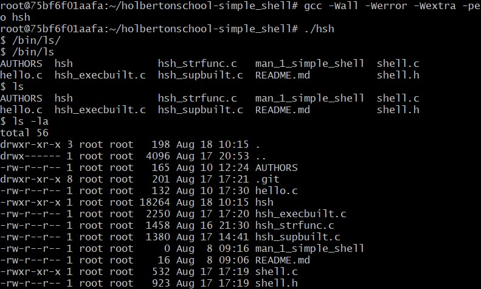
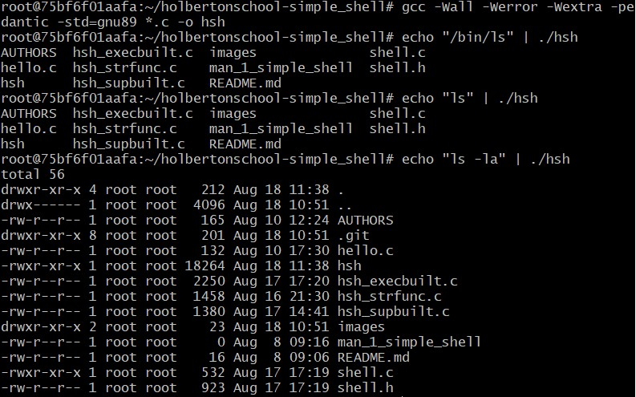

# Simple Shell Project

## Files Description Shell 📋

* **AUTHORS** - List of contributors to this repository
* **man_1_simple_shell** - Manual page for the simple_shell
* **shell.h** - Header File
* **shell.c** - Main Function
* **hello.c** - Check the code Betty
* **hsh_execbuilt.c** - 
        * **read_line** - Use getline
        * **token_generate** - Generate token
        * **execute** - Execute new process
        * **cmd** - Parse Command 
* **hsh_strfunc.c** - Function to get the arguments
        * **_strlen** - Length of the string
        * **_strcat** - Concatenates two strings
        * **_strcpy** - Copies string
        * **_strdup** - Duplicate one string
        * **_strcmp** - Comparation string
* **hsh_supbuilt.c** - Command required for builtin
        * **builtin_cmd** - We get the commands
        * **h_exit** - Commands the builtin
        * **h_cd** - Commands the builtin
        * **h_help** - Commands the builtin
        * **h_env** - Commands the builtin

## Usage Simple Shell ⚙️

* **Step 1:** Clone our repository using this command
```
git clone https://github.com/Daniela1026/holbertonschool-simple_shell.git
```
* **Step 2:** Change directory to holbertonschool-simple_shell
```
cd holbertonschool-simple_shell
```
* **Step 3:** Compile the C files in this way
```
gcc -Wall -Werror -Wextra -pedantic -std=gnu89 *.c -o hsh
```
* **Step 4:** Run the shell
```
./hsh
```
* **Step 5:** Run the shell
```
./hsh
```
* **Step 6:** Example interactive mode with /bin/ls, ls, ls -la

* **Step 7:** Example non-interactive mode with echo "/bin/ls" | ./hsh, echo "ls" | ./hsh, echo "ls -la" | ./hsh

